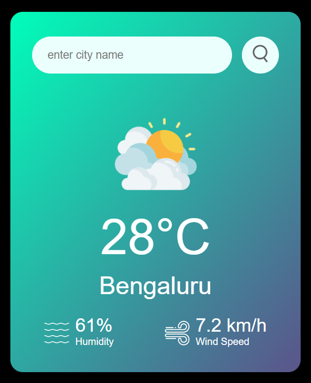

## Weather App
### tech: html, css, JS
-Weather App for Website using HTML CSS and JavaScript. We will get the current weather data from Fess API fey from OpenWeatherMap and display the weather information like Temperature,  Weather condition, Humidity and Wind Speed according to the city on our website or app.

-We will display the weather info on website from Free API using JavaScript.

-In this weather app we will add one search box where user can enter the city name and get the weather information of the particular city.

## Home

 

## Search Result

 

## Error Result

